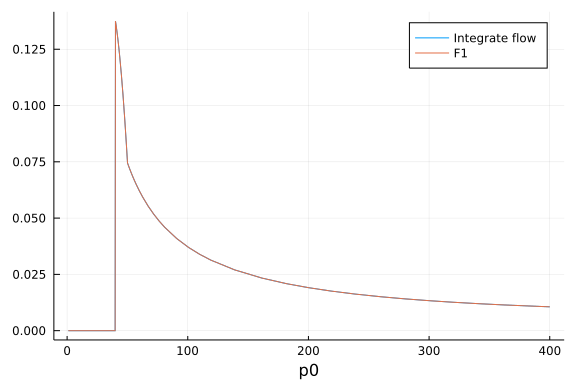
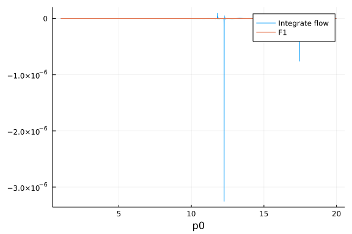

## Check F1 & F2

load package
```julia
using FRGRealTime,Plots,HCubature
```


Define integrate $\tilde{\partial_kF1}$ function:
```julia
testloopfunpp(p0,ps,k,m,T)=hquadrature(x->FRGRealTime.flowpp(p0,ps,x,m,T),0.0,k,initdiv=1000)[1]+FRGRealTime.loopfunpp(p0,ps,0.0,m,T)
```

```
testloopfunpp (generic function with 1 method)
```


Define integrate $\tilde{\partial_kF2}$ function:
```julia
testloopfunpm(p0,ps,k,m,T)=hquadrature(x->FRGRealTime.flowpm(p0,ps,x,m,T),0.0,k)[1]+FRGRealTime.loopfunpm(p0,ps,0.0,m,T)
```

```
testloopfunpm (generic function with 1 method)
```


### F1 Checking Results

 $k>ps,m>0,p_0\in (1.0,400.0)$
```julia
plot(p0->testloopfunpp(p0,10.0,20.0,1.0,145.0),1.0,400.0,label="Integrate flow",xaxis="p0")
plot!(p0->FRGRealTime.loopfunpp(p0,10.0,20.0,1.0,145.0),1.0,400.0,label="F1")
```




  $k>ps,m>0,p_0\in (1.0,10.0)$
```julia
plot(p0->testloopfunpp(p0,10.0,20.0,1.0,145.0),1.0,20.0,label="Integrate flow",xaxis="p0")
plot!(p0->FRGRealTime.loopfunpp(p0,10.0,20.0,1.0,145.0),1.0,20.0,label="F1")
```




 $ps/2<k<ps,m>0$
```julia
plot(p0->testloopfunpp(p0,10.0,8.0,1.0,145.0),1.0,400.0,label="Integrate flow",xaxis="p0")
plot!(p0->FRGRealTime.loopfunpp(p0,10.0,8.0,1.0,145.0),1.0,400.0,label="F1")
```


  $k<ps/2,m>0$
```julia
plot(p0->testloopfunpp(p0,10.0,4.0,1.0,145.0),1.0,400.0,label="Integrate flow",xaxis="p0")
plot!(p0->FRGRealTime.loopfunpp(p0,10.0,4.0,1.0,145.0),1.0,400.0,label="F1")
```


### F2 Checking Results

 $k>ps,m>0$
```julia
plot(p0->testloopfunpm(p0,10.0,20.0,1.0,145.0),1.0,20.0,label="Integrate flow",xaxis="p0")
plot!(p0->FRGRealTime.loopfunpm(p0,10.0,20.0,1.0,145.0),1.0,20.0,label="F2")
```


 $ps/2<k<ps,m>0$
```julia
plot(p0->testloopfunpm(p0,10.0,8.0,1.0,145.0),1.0,20.0,label="Integrate flow",xaxis="p0")
plot!(p0->FRGRealTime.loopfunpm(p0,10.0,8.0,1.0,145.0),1.0,20.0,label="F2")
```


 $k<ps/2,m>0$
```julia
plot(p0->testloopfunpm(p0,10.0,4.0,1.0,145.0),1.0,20.0,label="Integrate flow",xaxis="p0")
plot!(p0->FRGRealTime.loopfunpm(p0,10.0,4.0,1.0,145.0),1.0,20.0,label="F2")
```


