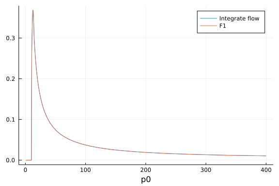
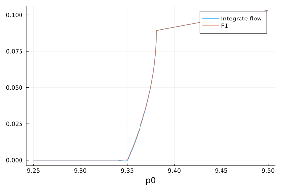
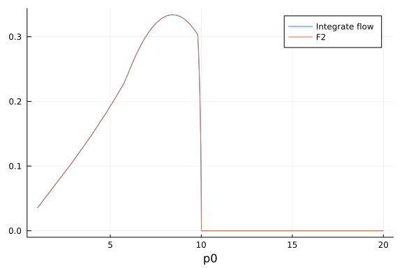

## Check F1 & F2

load package
```julia
using FRGRealTime,Plots,HCubature
```


Define integrate $\tilde{\partial_k}F1$ function:
```julia
testloopfunpp(p0,ps,k,m,T)=hquadrature(x->FRGRealTime.flowpp(p0,ps,x,m,T),0.0,k,initdiv=2000)[1]+FRGRealTime.loopfunpp(p0,ps,0.0,m,T)
```

```
testloopfunpp (generic function with 1 method)
```


Define integrate $\tilde{\partial_k}F2$ function:
```julia
testloopfunpm(p0,ps,k,m,T)=hquadrature(x->FRGRealTime.flowpm(p0,ps,x,m,T),0.0,k)[1]+FRGRealTime.loopfunpm(p0,ps,0.0,m,T)
```

```
testloopfunpm (generic function with 1 method)
```


Define integrate $\tilde{\partial_k}F1$ function for m<0:
```julia
testloopfunpp2(p0,ps,k,m,T)=-hquadrature(x->FRGRealTime.flowpp(p0,ps,x,m,T),k,400.0,rtol=1e-14,atol=1e-14,initdiv=10000)[1]+FRGRealTime.loopfunpp(p0,ps,400.0,m,T)
```

```
testloopfunpp2 (generic function with 1 method)
```


Define integrate $\tilde{\partial_k}F2$ function:
```julia
testloopfunpm2(p0,ps,k,m,T)=hquadrature(x->FRGRealTime.flowpm(p0,ps,x,m,T),2.0,k,initdiv=1000)[1]+FRGRealTime.loopfunpm(p0,ps,2.0,m,T)
```

```
testloopfunpm2 (generic function with 1 method)
```


### F1 Checking Results

 $k>ps,m>0,p_0\in (1.0,400.0)$
```julia
plot(p0->testloopfunpp(p0,10.0,20.0,1.0,145.0),1.0,400.0,label="Integrate flow",xaxis="p0")
plot!(p0->FRGRealTime.loopfunpp(p0,10.0,20.0,1.0,145.0),1.0,400.0,label="F1")
```


  $k>ps,m>0,p_0\in (1.0,10.0)$
```julia
plot(p0->testloopfunpp(p0,10.0,20.0,1.0,145.0),1.0,20.0,label="Integrate flow",xaxis="p0")
plot!(p0->FRGRealTime.loopfunpp(p0,10.0,20.0,1.0,145.0),1.0,20.0,label="F1")
```


 $ps/2<k<ps,m>0$
```julia
plot(p0->testloopfunpp(p0,10.0,8.0,1.0,145.0),1.0,400.0,label="Integrate flow",xaxis="p0")
plot!(p0->FRGRealTime.loopfunpp(p0,10.0,8.0,1.0,145.0),1.0,400.0,label="F1")
```


  $k<ps/2,m>0$
```julia
plot(p0->testloopfunpp(p0,10.0,2.0,1.0,145.0),1.0,400.0,label="Integrate flow",xaxis="p0")
plot!(p0->FRGRealTime.loopfunpp(p0,10.0,2.0,1.0,145.0),1.0,400.0,label="F1")
```




 $k>ps,m<0,p_0\in (1.0,400.0)$
```julia
plot(p0->testloopfunpp2(p0,10.0,20.0,-3.0,145.0),1.0,400.0,label="Integrate flow",xaxis="p0")
plot!(p0->FRGRealTime.loopfunpp(p0,10.0,20.0,-3.0,145.0),1.0,400.0,label="F1")
```


 $ps/2<k<ps,m<0$
```julia
plot(p0->testloopfunpp2(p0,10.0,8.0,-3.0,145.0),1.0,400.0,label="Integrate flow",xaxis="p0")
plot!(p0->FRGRealTime.loopfunpp(p0,10.0,8.0,-3.0,145.0),1.0,400.0,label="F1")
```


 $k<ps/2,m>0$
```julia
plot(p0->testloopfunpp2(p0,10.0,2.0,-3.0,145.0),1.0,400.0,label="Integrate flow",xaxis="p0")
plot!(p0->FRGRealTime.loopfunpp(p0,10.0,2.0,-3.0,145.0),1.0,400.0,label="F1")
```


 $k<ps/2,m<0$
```julia
plot(p0->testloopfunpp2(p0,10.0,4.0,-3.0,145.0),9.25,9.5,label="Integrate flow",xaxis="p0")
plot!(p0->FRGRealTime.loopfunpp(p0,10.0,4.0,-3.0,145.0),9.25,9.5,label="F1")
```




### F2 Checking Results

 $k>ps,m>0$
```julia
plot(p0->testloopfunpm(p0,10.0,20.0,1.0,145.0),1.0,20.0,label="Integrate flow",xaxis="p0")
plot!(p0->FRGRealTime.loopfunpm(p0,10.0,20.0,1.0,145.0),1.0,20.0,label="F2")
```


 $ps/2<k<ps,m>0$
```julia
plot(p0->testloopfunpm(p0,10.0,8.0,1.0,145.0),1.0,20.0,label="Integrate flow",xaxis="p0")
plot!(p0->FRGRealTime.loopfunpm(p0,10.0,8.0,1.0,145.0),1.0,20.0,label="F2")
```


 $k<ps/2,m>0$
```julia
plot(p0->testloopfunpm(p0,10.0,2.0,1.0,145.0),1.0,20.0,label="Integrate flow",xaxis="p0")
plot!(p0->FRGRealTime.loopfunpm(p0,10.0,2.0,1.0,145.0),1.0,20.0,label="F2")
```




 $k>ps,m<0$
```julia
plot(p0->testloopfunpm2(p0,10.0,20.0,-3.0,145.0),1.0,20.0,label="Integrate flow",xaxis="p0")
plot!(p0->FRGRealTime.loopfunpm(p0,10.0,20.0,-3.0,145.0),1.0,20.0,label="F2")
```


 $ps/2<k<ps,m<0$
```julia
plot(p0->testloopfunpm2(p0,10.0,8.0,-3.0,145.0),1.0,20.0,label="Integrate flow",xaxis="p0")
plot!(p0->FRGRealTime.loopfunpm(p0,10.0,8.0,-3.0,145.0),1.0,20.0,label="F2")
```


 $k<ps/2,m<0$
```julia
plot(p0->testloopfunpm2(p0,10.0,2.0,-3.0,145.0),1.0,20.0,label="Integrate flow",xaxis="p0")
plot!(p0->FRGRealTime.loopfunpm(p0,10.0,2.0,-3.0,145.0),1.0,20.0,label="F2")
```


## Check Vertex

The flow equation of vertex has the following form:
```math
\begin{aligned}
&\partial_kV_k=\lambda_{4\pi}(k)^2 *\tilde{\partial_k}\left\{3\pi (2 + Npi) \left(\\
&F1(p_0-q_0,|\mathbb{p}_s+\mathbb{q}_s|,k,m(k))+F2(p_0-q_0,|\mathbb{p}_s+\mathbb{q}_s|,k,m(k))
+F1(p_0+q_0,|\mathbb{p}_s+\mathbb{q}_s|,k,m(k))+F2(p_0+q_0,|\mathbb{p}_s+\mathbb{q}_s|,k,m(k))\right)\right\}
\end{aligned}
```
