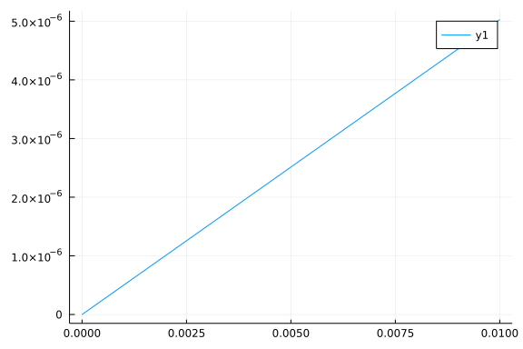

# Theory Preset

## Two point function flow

The flow of two point function is:

```math
\begin{aligned}
&\partial_{\tau} \Gamma_{k, \phi_{q} \phi_{c}}^{(2)}\left(p_{0},p_s\right) \\
&=-\frac{1}{24} \frac{(N+2)}{(2 \pi)^{2}}\left[-\frac{\coth\left(\frac{E_{\pi, k}(k)}{2 T}\right)}{\left(E_{\pi, k}(k)\right)^{3}}-\frac{\operatorname{csch}^{2}\left(\frac{E_{\pi, k}(k)}{2 T}\right)}{2 T\left(E_{\pi, k}(k)\right)^{2}}\right] \\
&\times\left(2 k^{2}\right) \int_{0}^{k} dq  q_s^{2} \int_{-1}^{1} d \cos \theta
\end{aligned}
```


```julia
using FRGRealTime, Plots
```


plot a fig

```julia
plot(sin,-1,1)
```


