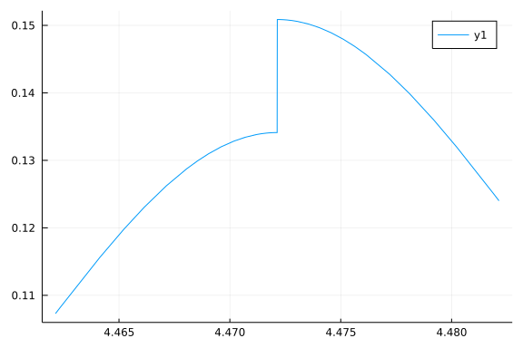

# Delta Function

## Integrate Dirac Delta in $F_1$


There are two types of dirac delta function we need to handle. One is due to the existence of
$\theta\left(p_0-2E_\pi\right)$, the other is due to the existence of $\delta\left(p_0-2E_\pi\right)$.

For the first one, we can see the plot around $p_0=2E_\pi$
```julia
using FRGRealTime,Plots
#k>ps
plot(p0->FRGRealTime.loopfunppfix(p0,1.0,2.0,1.0,2.0),2*Epi(2.0,1.0)-0.01,2*Epi(2.0,1.0)+0.01)
```




Considering that our function has the following form:

```math
    F(k)=f(k)\theta\Big(g(k)-p_0\Big)
```
and this relation is only true when $p_0$ is in a infinitesimal neighborhood around $g(k)$.
$F'(k)$ is:

```math
    F'(k)=f(k) g'(k) \delta \Big(g(k)-p_0\Big)+f'(k) \theta \Big(g(k)-p_0\Big)
```

Now we want to integrate back to $F(k)$, any finite part will disappear due to the infinitesimal measure, so:

```math
    F'(k)=f(k) g'(k) \delta \Big(g(k)-p_0\Big)=f(k)\partial_k \theta\Big(g(k)-p_0\Big)
```


$F_1$ is $\theta$ function when $k>\frac{p_s}{2}$ and $p_0$
is around $2E_\pi(k,m)$. It has a $drop=\frac{\left(2 k-p_s\right) \coth \left(\frac{\sqrt{k^2+m^2}}{2 T}\right)}{16
\pi ^2 \sqrt{k^2+m^2}}$ drop in $p_0=2E_\pi(k,m)$. $F_1$ can be written as:

$$
    F_1=drop\;\theta\Big(p_0-2E_\pi(k,m)\Big)
$$
when $p_0=2E_\pi(k,m)$ :

$$
    \partial_k F_1=-drop\;\frac{2k}{E_\pi(k,m)}\delta\Big(p_0-2E_\pi(k,m)\Big)
$$
alternatively:

$$
    \partial_k F_1=-drop\; \delta\!\left(k-\frac{1}{2} \sqrt{p_0^2-4 m^2}\right)
$$

### Im Part
